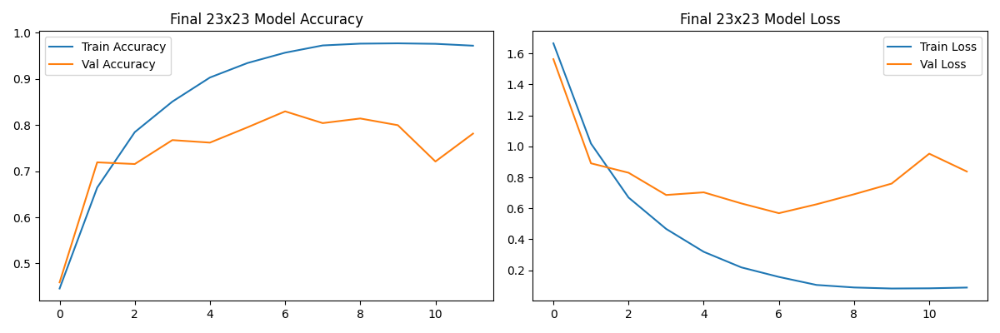
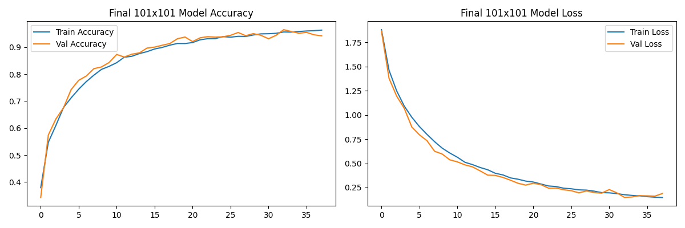

# 🥦 Vegetable Image Classifier CNN 


**A Convolutional Neural Network (CNN) for classifying grayscale vegetable images into multiple classes at two resolutions (23x23 and 101x101).**

---

## 🧩 Features

- 🥕 **Multi-Resolution Classification**: Train and evaluate models on both 23x23 and 101x101 images.  
- 📊 **Performance Comparison**: Compare accuracy between different resolutions.  
- 🧪 **Model Training & Evaluation**: Includes training pipelines, validation, and metrics.  
- 📈 **Visualization**: Training and validation accuracy/loss plots for analysis.  

---

## 📚 Dataset

- **Custom Vegetable Dataset**  
  - Grayscale images of 11 vegetable classes.  
  - Two resolutions: 23x23 and 101x101 pixels.  

---

## 🏗 Model Architecture

**Convolutional Neural Network (CNN)** with:  

- **Convolutional Layers**: Extract spatial features from images.  
- **Max-Pooling Layers**: Reduce spatial dimensions and retain important features.  
- **Fully Connected Layers**: Map extracted features to class probabilities.  
- **Activation Functions**: ReLU for hidden layers, softmax for output layer.  

Optimized using KerasTuner for best accuracy on both resolutions.

---

## ⚙️ Installation

```bash
# Clone the repository
git clone https://github.com/4ndrrw/Vegetable-Image-Classifier-CNN.git
cd Vegetable-Image-Classifier-CNN

# Create virtual environment
python -m venv venv
source venv/bin/activate  # Windows: venv\Scripts\activate

# Install dependencies
pip install -r requirements.txt
```

---

## 📈 Results

### 23x23 Resolution Model


### 101x101 Resolution Model


*The 101x101 model achieved higher accuracy due to increased input resolution.*

---

## 🛠 Tech Stack


---

## 🤝 Contributing

1. Fork the repository.  
2. Create a new branch (`git checkout -b feature-branch`).  
3. Commit your changes (`git commit -am 'Add new feature'`).  
4. Push to the branch (`git push origin feature-branch`).  
5. Open a Pull Request.

---
